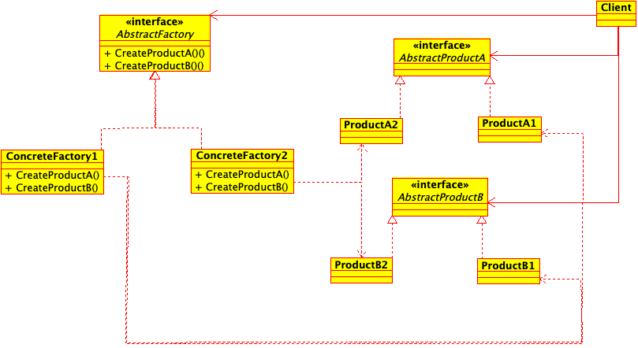

# Patterns

## How to Build Examples and Run Tests
### C++ Code with CMake
[CMake](https://cmake.org/) (version >= 3.24) is the build tool that manages all of the C++
code in this project. Code is compiled with a C++20 compiler.

#### Normal Usage
1. `cmake -S. -Bbuild` to create a separate build folder to isolate generate cmake build
files. 
2. `cmake --build build --parallel && ctest --test-dir build --parallel` to compile source and run tests.  

## Table of Contents
1. [Creational](#creational) \
a. [Abstract Factory](#abstract-factory) \
b. Builder \
c. Factory Method \
d. Prototype \
e. Singleton 
2. Structural \
a. Adapter \
b. Bridge \
c. Composite \
d. Facade \
e. Flyweight \
f. Proxy 
3. Behavioral \
a. Chain of Responsibility \
b. Command \
c. Interpreter \
d. Iterator \
e. Mediator \
f. Memento \
g. Observer \
h. State \
i. Strategy \
j. Template Method \
k. Visitor
4. Subsystem and Component Architecture \
a. Layered \
b. Five-Layer Architecture \
c. Microkernel Architecture \
d. Channel Architecture \
e. Recursive Containment \
f. Hierarchial Control \
g. Virtual Machine \
h. Component-Based Architecture \
i. ROOM 
5. Concurrency \
a. Message Queuing \
b. Interrupt \
c. Guarded Call \
d. Rendezvous \
e. Cyclic Executive \
f. Round Robin \
g. Static Priority \
h. Dynamic Priority 
6. Memory \
a. Static Allocation \
b. Pool Allocation \
c. Fixed Sized Buffer \
d. Smart Pointer \
e. Garbage Collection \
f. Garbage Compactor
7. Resource \
a. Critical Section \
b. Priority Inheritance \
c. Highest Locker \
d. Priority Ceiling \
e. Simultaneous Locking \
f. Ordered Locking 
8. Distribution \
a. Shared Memory \
b. Remote Method Call \
c. Observer \
d. Data Bus \
e. Proxy \
f. Broker 
9. Safety and Reliability \
a. Protected Single Channel \
b. Homogeneous Redundancy \
c. Triple Modular Redundancy \
d. Heterogeneous Redundancy \
e. Montior-Actuator \
f. Sanity Check \
g. Watchdog \
h. Safety Executive

## Creational 
Creational design patterns abstract the instantiation process. They help make a 
system independnent of how its objects are created, composed, and represented. A 
class creational pattern uses inheritance to vary the class that's instantiated,
whereas an object creational pattern will delegate instantiation to another 
object. Creational patterns become important as systems evolve to depend more
on object composition than class inheritance.

### Abstract Factory

**Intent**: Provide an interface for creating families of related or dependent
objects without specifying their concrete classes.
	
**Applicability**: Use the Abstract Factory pattern when
- a system should be independent of how its products are created, composed, and represented.
- a system should be configured with one of multiple families of products.
- a family of related product objects is designed to be used together, and you need to enforce this constraint.
- you want to provide a class library of products, and you want to reveal just their interfaces, not their implementations.

## References 
* Gamma, Erich, et al. - Design Patterns: Elements of Reusable Object-Oriented 
Software
* Douglas, Bruce Powel - Real-Time Design Patterns: Robust Scalable Architecture 
for Real-Time Systems
