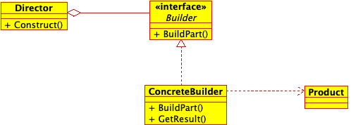
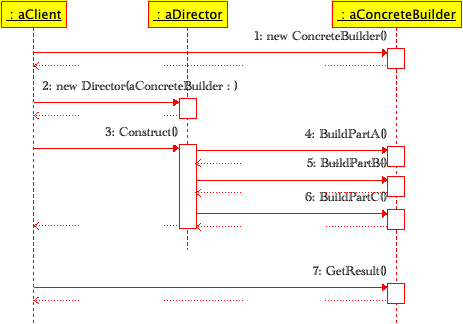
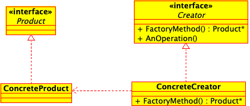
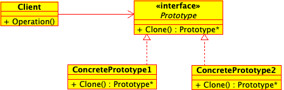
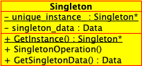
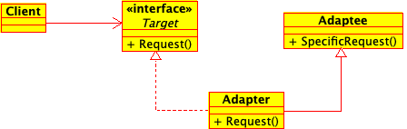
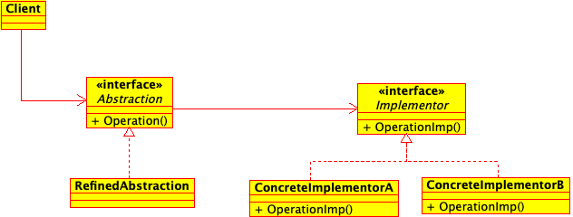

# Patterns

## How to Build Examples and Run Tests
### C++ Code with CMake
[CMake](https://cmake.org/) (version >= 3.24) is the build tool that manages all 
of the C++ code in this project. Code is compiled with a C++20 compiler.

#### Normal Usage
1. `cmake -S. -Bbuild` to create a separate build folder to isolate generate 
cmake build files. 
2. `cmake --build build --parallel 4 && ctest --test-dir build --parallel 4` to 
compile source and run tests.  

## Table of Contents
1. [Creational](#creational) \
a. [Abstract Factory](#abstract-factory) \
b. [Builder](#builder) \
c. [Factory Method](#factory-method) \
d. [Prototype](#prototype) \
e. [Singleton](#singleton)
2. [Structural](#structural) \
a. [Adapter](#adapter) \
b. [Bridge](#bridge) \
c. [Composite](#composite) \
d. [Decorator](#decorator) \
e. [Facade](#facade) \
f. [Flyweight](#flyweight) \
g. [Proxy](#proxy) 
3. [Behavioral](#behavioral) \
a. [Chain of Responsibility](#chain-of-responsibility) \
b. [Command](#command) \
c. [Interpreter](#interpreter) \
d. [Iterator](#iterator) \
e. [Mediator](#mediator) \
f. [Memento](#memento) \
g. [Observer](#observer) \
h. [State](#state) \
i. [Strategy](#strategy) \
j. [Template Method](#template-method) \
k. [Visitor](#visitor)
4. Subsystem and Component Architecture \
a. Layered \
b. Five-Layer Architecture \
c. Microkernel Architecture \
d. Channel Architecture \
e. Recursive Containment \
f. Hierarchial Control \
g. Virtual Machine \
h. Component-Based Architecture \
i. ROOM 
5. Concurrency \
a. Message Queuing \
b. Interrupt \
c. Guarded Call \
d. Rendezvous \
e. Cyclic Executive \
f. Round Robin \
g. Static Priority \
h. Dynamic Priority 
6. Memory \
a. Static Allocation \
b. Pool Allocation \
c. Fixed Sized Buffer \
d. Smart Pointer \
e. Garbage Collection \
f. Garbage Compactor
7. Resource \
a. Critical Section \
b. Priority Inheritance \
c. Highest Locker \
d. Priority Ceiling \
e. Simultaneous Locking \
f. Ordered Locking 
8. Distribution \
a. Shared Memory \
b. Remote Method Call \
c. Observer \
d. Data Bus \
e. Proxy \
f. Broker 
9. Safety and Reliability \
a. Protected Single Channel \
b. Homogeneous Redundancy \
c. Triple Modular Redundancy \
d. Heterogeneous Redundancy \
e. Montior-Actuator \
f. Sanity Check \
g. Watchdog \
h. Safety Executive
10. Test Strategy Patterns \
a. Recorded Test \
b. Scripted Test \
c. Data-Driven Test \
d. Test Automation Framework \
e. Minimal Fixture \
f. Standard Fixture \
g. Fresh Fixture
11. xUnit Basics Patterns \
a. Test Method \
b. Four-Phase Test \
c. Assertion Method \
d. Assertion Message \
e. Testcase Class \
f. Test Runner \
g. Testcase Object \
h. Test Suite Object \
i. Test Discovery \
j. Test Enumeration \
k. Test Selection 
12. Fixture Setup Patterns \
a. In-line Setup 

| Pattern                                            | UML                                            | Code                                                                 | Tests |
|----------------------------------------------------|------------------------------------------------|----------------------------------------------------------------------|-------|
| [Abstract Factory](#abstract-factory)              | [:heavy_check_mark:](img/abstract-factory.png) | [:heavy_check_mark:](src/creational/abstract-factory/maze-factory.h) |       |
| [Builder](#builder)                                | [:heavy_check_mark:](img/builder.png)          | [:heavy_check_mark:](src/creational/builder/maze-builder.h)          |       |
| [Factory Method](#factory-method)                  | [:heavy_check_mark:](img/factory-method.png)   |                                                                      |       |
| [Prototype](#prototype)                            | [:heavy_check_mark:](img/prototype.png)        |                                                                      |       |
| [Singleton](#singleton)                            | [:heavy_check_mark:](img/singleton.png)        |                                                                      |       |
| [Adapter](#adapter)                                |                                                |                                                                      |       |
| [Bridge](#bridge)                                  |                                                |                                                                      |       |
| [Composite](#composite)                            |                                                |                                                                      |       |
| [Decorator](#decorator)                            |                                                |                                                                      |       |
| [Facade](#facade)                                  |                                                |                                                                      |       |
| [Flyweight](#flyweight)                            |                                                |                                                                      |       |
| [Proxy](#proxy)                                    |                                                |                                                                      |       |
| [Chain of Responsiblity](#chain-of-responsibility) |                                                |                                                                      |       |
| [Command](#command)                                |                                                |                                                                      |       |
| [Interpreter](#interpreter)                        |                                                |                                                                      |       |
| [Iterator](#iterator)                              |                                                |                                                                      |       |
| [Mediator](#mediator)                              |                                                |                                                                      |       |
| [Memento](#memento)                                |                                                |                                                                      |       |
| [Observer](#observer)                              |                                                |                                                                      |       |
| [State](#state)                                    |                                                |                                                                      |       |
| [Strategy](#strategy)                              |                                                |                                                                      |       |
| [Template Method](#template-method)                |                                                |                                                                      |       |
| [Visitor](#visitor)                                |                                                |                                                                      |       |

## Creational 
Creational design patterns abstract the instantiation process. They help make a 
system independnent of how its objects are created, composed, and represented. A 
class creational pattern uses inheritance to vary the class that's instantiated,
whereas an object creational pattern will delegate instantiation to another 
object. Creational patterns become important as systems evolve to depend more
on object composition than class inheritance.

### Abstract Factory
 \
**Intent**: Provide an interface for creating families of related or dependent
objects without specifying their concrete classes.
	
**Applicability**: Use the Abstract Factory pattern when
- a system should be independent of how its products are created, composed, and 
represented.
- **a system should be configured with one of multiple families of products.**
- a family of related product objects is designed to be used together, and you 
need to enforce this constraint.
- you want to provide a class library of products, and you want to reveal just 
their interfaces, not their implementations.
- An application typically only needs one instance of a ConcreteFactory per
  product family so it's best implemented as a Singleton.
- AbstractFactory only declares an interface for creating products so it's up to
  the ConcreteProduct subclasses to actually create them. The most common way to
  do this is to define a Factory Method. If man product families are possible,
  the concrete factory can be implemented using the Prototype pattern.

### Builder
 \
 \
**Intent**: Separate the construction of a complex object from its representation
so that the same construction process can create different representations.

**Applicability**: User the Builder pattern when
- the algorithm for creating a complex object should be independent of the parts
  that make up the object and how they are assembled.
- **the construction process must allow different representations for the object
  that's constructed.**
- in the common case, the products produced by the concrete builers differ so
  greatly in their representation that there is little to gain from having a
  common abstract class/interface for the different products.
  
**Interactions**: An Abstract factory is similar to Builder in that it too may
construct complex objects. The primary differece is that the Builder pattern
focuses on constructing a complex object styp by step. Abstract Factory's
emphasis is on families of product objects (either simple of complex). Builder
returns the product as a final step, but as far as the Abstract Factory pattern
is concerned, the product gets returned immediately.

A Composite is what the builder often builds.
  
### Factory Method
 \
**Intent**: (aka Virtual Constructor) Define an interface for creating an object,
but let subclasses decide which class to instantiate. Factory Method lets a class
defer instantiation to subclasses.

**Applicability**: Use the Factory Method pattern when
- a class can't anticipate the class of objects it must create.
- a class wants its subclasses to specify the objects it create.
- classes delegate responsiblitiy to one of several helper subclasses, and you
  want to localize the knowledge of which helper subclass to delegate.
  
### Prototype
 \
**Intent**: Specify the kinds of objects to create using a prototypical instance,
and create new objects by copying this prototype.

**Applicability**: Use the Prototype pattern when a system should be independent
of how its products are created, composed, and represented; and
- when the classes to instantiate are specified at run-time, by example, by
  dynamic laoding, or
- to avoid building a class hierarchy of factories that parallels the calss
  hierarchy of products; or
- when instances of a class can have one of only a few different combinatiosn of
  state. It may be more conventient to install a corresponding number of
  prototypes and clone them rather than instrantiating the class manually, each
  time with the appropriate state.
  
### Singleton
 \
**Intent**: Ensure a class only has one instance, and provide a global point of
access to it.

**Applicability**: Use the Singleton pattern when
- there must be exactly one instance of a calss, and it must be accessible to
  clients from a well-known access point.
- when the sole instance should be extensible by subclassing, and clients should
  be able to use an extended instance without modifying their code.

## Structural
### Adapter
 \
**Intent**: (aka Wrapper) Convert he interface of a class into another interface
clients expect. Adapter lets classes work together that couldn't otherwise
because of incompatible interfaces.

**Applicability**: Use the Adapter pattern when
- you want to use an existing class, and its interface does not match the one you
  need.
- you want to create a reusable class that cooperates with unrelated or unforseen
  classes, that is, classes that don't necessarily have compatible interfaces.
- (object adapter only) you need to use several existing subclasses, but it's
  impractical to adapt their interface by subclassing every one. An object
  adapter can adapt the interface of its parent class.
### Bridge
 \
**Intent**: (aka Handle/Body) Decouple an abstraction from its implementation so
that the two can vary independently

**Applicability**: Use the Bridge pattern when
- you want to avoid a permanent binding between an abstraction and its
  implementaion. This might be the case, for example, when the implementation
  must be selected or switched at run-time.
- both the abstractions and their implementation should be extensible by
  subclassing. In this case, the Bridge pattern lets you combine the different
  abstractions and implementatiopns and extend them independently
- changes in the implementation of an abstraction should have no impact on
  clients; that is, their code should not have to be recompiled.
- (C++) you want to hide the implementation of an abstraction completely from
  clients. In C++ the representation of a class is visible in the class
  interface.
- you have a proliferation of classes as shown earlier in the first Motivation
  diagram. Such a class hierarchy indicates the need for splitting an object into
  two parts. Rumbaugh uses the term "nested generalizations" to refer to such
  hierarchies.
- you want ot share an implementation among multiple objects (perhaps using
  reference counting), and this fact should be hidden from the client. A simple
  example is Coplien's String class, in which multiple objects can share the same
  representation.
### Composite
 \
**Intent**: Compose objects into tree structures to represent part-whole
hierarchies. Composite lets clients treat individual objects and compositions of
objects uniformly.

**Applicability**: Use the Composite pattern when
- you want to represent part-whole hierarchies of objects.
- you want clients to be able to ignore the difference between compositions of
  objects and individual objects. Clients will treat all objects in the composite
  structure uniformly.
### Decorator
### Facade
### Flyweight
### Proxy

## Behavioral
### Chain of Responsibility
### Command
### Interpreter
### Iterator
### Mediator
### Memento
### Observer
### State
### Strategy
### Template Method
### Visitor

## References 
* Gamma, Erich, et al. - Design Patterns: Elements of Reusable Object-Oriented 
Software
* Douglas, Bruce Powel - Real-Time Design Patterns: Robust Scalable Architecture 
for Real-Time Systems
* Meszaros, Gerard - xUnit Testing Patterns
* Binder, Robert - Testing Object-Oriented Systems: Models, Patterns, and Tools
* Freeman, Steve, and Nat Pryce - Growing Object-Oriented Software, Guided by Tests
